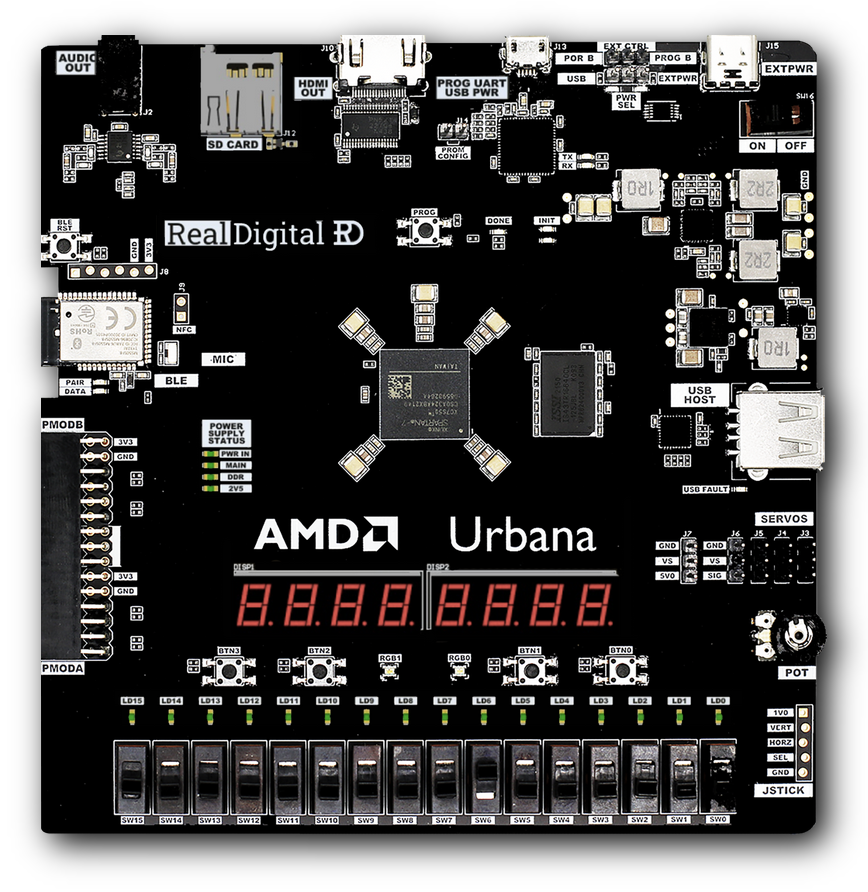

# How to use an FPGA
A simple demonstration + discussion. <br>

---

# What is an FPGA ?

---


<!-- source: Andi's blog about 6.2050 at MIT - https://mitadmissions.org/blogs/entry/6-2050-field-programmable-gate-awesomeness/ -->

---

# Toys for today
all the equipment that we're going to use.

---

- The AMD Urbana
- Xilinx Vivado




---

# What FPGA does the AMD Urbana have?

---

### The Spartan-7 XC7S50 <br> on an AMD Urbana

(xc7s50csga324-1)


Composition:
    - Logic: 52160
    - DSP: 120
    - Memory: 2700
    - I/O: 250

#### are these slices or cells ?

---

# Let's play with the GPIO
#### Point them out on the board

---

### 1. Create a pointer to the base address of the LED IP
```C
#define XPAR_LED_IP_0_BASEADDR 0x0; // is this right ?
uint32_t* my_led_ptr = (uint32_t*) XPAR_LED_IP_0_BASEADDR;
```

### 2. Write a value to that address
```C
*(my_led_ptr) = 0x55;
```

#### What happened on the board ?

---

### Let's try this one more time.
This time, use the following piece of code:

```C
#include "xparameters.h"
#include "sleep.h"


uint32_t* my_led_ptr;

int main()
{
  my_led_ptr =(uint32_t*) XPAR_LED_IP_0_BASEADDR;

  while (1)
  {
    *(my_led_ptr) = 0x55;
    sleep(1);
    *(my_led_ptr) = 0xAA;
    sleep(1);
  }

  return 0;
}
```

#### What happened now ?