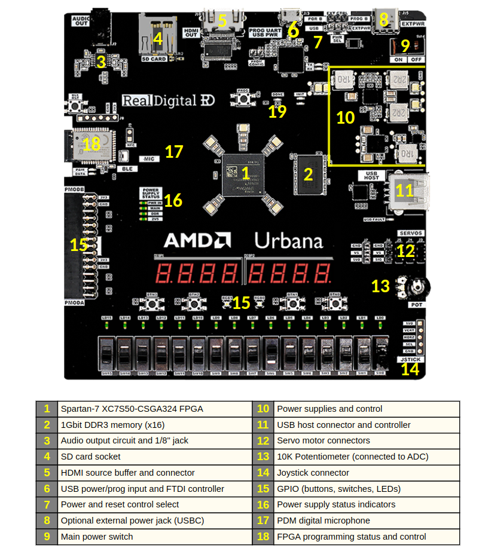

# How to use an FPGA
A simple demonstration + discussion.  

---

### The Spartan-7 XC7S50   on an AMD Urbana

(xc7s50csga324-1)

Composition:
    - Logic: 52160
    - DSP: 120
    - Memory: 2700
    - I/O: 250

#### are these slices or cells ?

